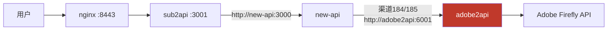
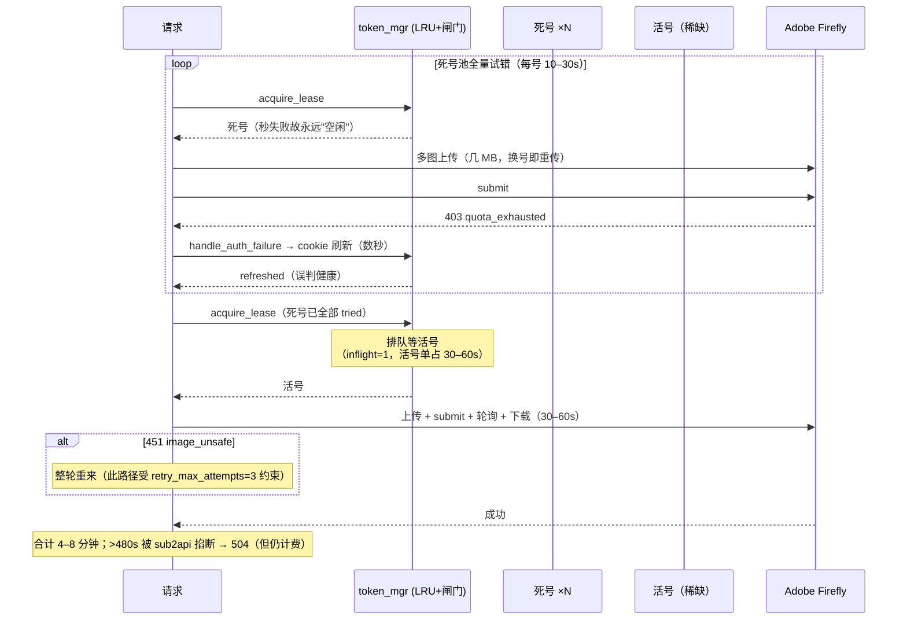
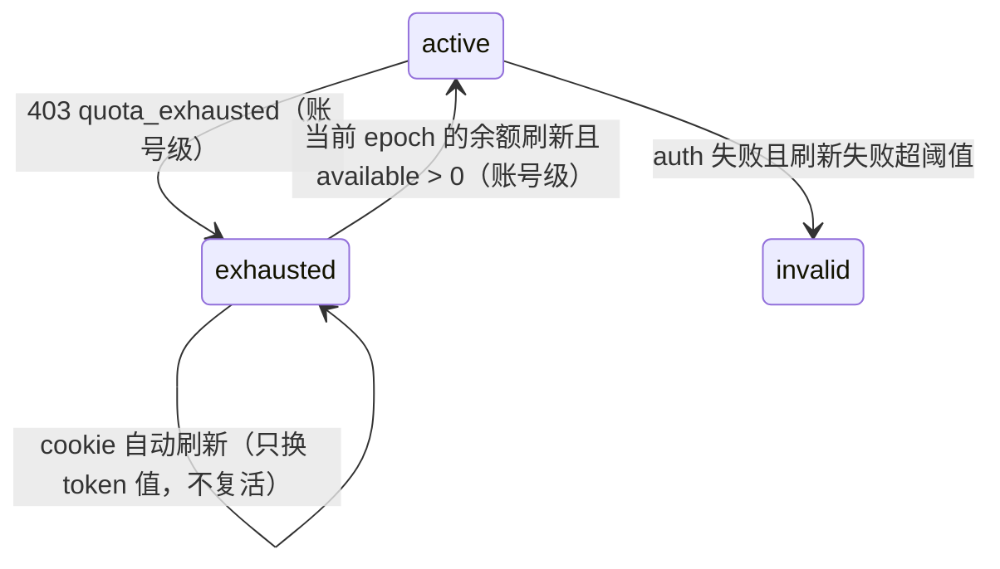

# 生图 400 秒延迟事故分析与修复方案

- **日期**: 2026-08-06
- **修订**: v2（同日）——按第一轮评审修订 §4-P5、§5 全节、§6、附录 A：配额状态改账号粒度、修正自动刷新无条件复活、deadline 端到端贯穿、分类函数统一并覆盖视频路径、余额字段与时效修正、超时层级方向修正
- **修订**: v3（同日）——按第二轮评审修订：出池改用 `lease.account_key` 直传（防 token 值被自动刷新替换后反查漏标）、复活加 `quota_exhausted_at` 乱序防护（写余额+复活判断同锁）、`credits_available_until` 按日期字符串解析且余额过滤按账号聚合、5.3a 更正为"底层 deadline 能力已存在，仅需三处接线"、deadline 异常文案中性化、换号配置键规范化（`.`→`_`）并同步 ConfigManager/schema/管理接口、§5.5 吞吐量纲修正、§6 指标按 reason 拆分且区分失败上限与性能目标
- **修订**: v4（同日）——按第三轮评审修订：余额字段读取增加安全解析、乱序防护从秒级时间戳改为账号级递增版本号 `quota_epoch`、`set_credits_and_maybe_revive` 补齐 `credits_total`/`credits_used`/`credits_error` 全字段、明确 deadline 的"真端到端 vs 仅约束上游"口径（输入图加载在 `generation.py:1108` 先于 `_execute()`）、根因一句话与 P5 表述对齐
- **修订**: v5（同日）——按第四轮评审修订：覆盖三个生产配额出池入口和 Adobe 余额刷新收口点、给余额快照绑定 `quota_epoch` 并禁止失配快照参与复活/fast-path、补齐输入图加载的剩余时间实现、修正 helper 类型说明与验证清单/附录索引
- **修订**: v6（同日）——**全文断言经代码逐条核实后校正**（6 组并行核实，11 条断言非完全成立）。实质修正：测试基线 65→**1076**；fast-path 挂载点补 `_pick_active_token_locked`/`get_available_for_account` 并置于 `_ready_pool_locked` 兜底之后；`account_key_for_id()` 标注为**待新增**并补 token_id 为空的兜底；澄清 `quota_epoch` **不是** `credits.updated_at`；deadline 补 multipart 分支与 Leonardo CDN 下载；配置同步四处→**五处**并注意 gemini 驼峰键压平；`requests.ProxyError` 笔误实为 **7 处**且后果是吃掉兜底分支。核实结论逐条见附录 C。
- **影响范围**: `/v1/images/edits`（gpt-image-2）为主，`/v1beta/models/*:generateContent`（gemini 系）偶发
- **用户侧现象**: 一张图 400+ 秒才返回，部分请求 504
- **结论（一句话）**: Adobe 返回的配额耗尽错误码 `quota_exhausted` 与代码中匹配的 `taste_exhausted` 不一致，配额耗尽被误分类为 auth 错误——**配额事件无法把死号正确出池，且 cookie 自动刷新还会把已耗尽账号错误复活**（详见 §4-P5）；每个请求因此在死号池里全量试错（撞 403 + 触发 cookie 刷新 + 多图重复上传），叠加活号被并发闸门串行化，单请求被拖到 4–8 分钟。

---

## 1. 现象与影响

| 观测点 | 数据（2026-08-06 10:47–10:57 慢窗口） |
|---|---|
| 用户端 | 单张图 400+ 秒；部分请求 504 |
| nginx `timing.log` | `/v1/images/edits` rt=200–480s，且 `urt≈rt`（时间全在后端，非传输） |
| sub2api | edits 大量 `latency_ms=480000` 后 `context deadline exceeded` → 504 |
| new-api | 同批 edits GIN 日志实际耗时 **4m–8m**（最高 `7m59.99s`） |
| adobe2api | 面板"生图时间"很短（只统计最终成功那次提交后的生成耗时） |
| 错误统计（1 小时） | `quota_exhausted` 403 × **1362**；`retrying operation=images.edits` × **880**；成功 edits 仅 **636**；最高 `attempt=7` |

**计费副作用**: sub2api 在 480s 掐断连接后，new-api/adobe2api 并不知情，继续跑完并正常计费——用户拿到 504 但额度已扣（慢窗口内多笔 7m+ 的 200 完成于 sub2api 已断开之后）。

---

## 2. 排查路径（Evidence → Finding）

链路: **用户 → nginx(8443) → sub2api → new-api → adobe2api → Adobe Firefly**



### 2.1 排除传输层

nginx `timing.log`（`rt`=总时长，`urt`=上游响应时长）:

```text
[06/Aug/2026:10:55:00 x.x.x.x /v1/images/edits 504 rt=480.604 urt=480.004
[06/Aug/2026:10:54:55 x.x.x.x /v1/images/edits 200 rt=461.239 urt=461.044
```

`urt≈rt` → 不是用户下载 7–10MB base64 响应慢，时间全部消耗在上游内部。

### 2.2 定位 sub2api 只是在干等

追踪一笔 480s 请求（request_id `d391f423-…`）在 sub2api 中的完整生命周期，中间**没有任何重试**，就是一次转发挂死:

```text
10:49:00.810  content_moderation.gateway_check_start
10:49:00.811  content_moderation.gateway_check_done
10:57:00.806  ERROR openai.images.forward_failed
              error: upstream request failed:
              Post "http://new-api:3000/v1/images/edits": context deadline exceeded
10:57:00.807  http request completed  status_code=504 latency_ms=480004
```

→ 480s 是 sub2api 自己的 deadline，堵点在 new-api 之后。

### 2.3 定位 new-api 也只是在干等

```text
[GIN] 10:55:02 | 200 | 7m49.216s | 172.18.0.10 | POST /v1/images/edits
[GIN] 10:56:03 | 200 | 7m42.158s | 172.18.0.10 | POST /v1/images/edits
[GIN] 10:57:00 | 200 | 7m59.990s | 172.18.0.10 | POST /v1/images/edits
```

渠道 184（大香蕉_adobe）、185（gpt-image-2）的 `base_url` 均为 `http://adobe2api:6001` → 4–8 分钟全部发生在 **adobe2api 内部**。

### 2.4 adobe2api 内部：撞 403 + 重试风暴

慢窗口日志（节选）:

```text
02:47:00.998Z submit auth failed status=403 access_error=quota_exhausted
              body={"error_code":"access_error","message":"Unauthorized to perform request."}
02:47:02.976Z retrying operation=images.edits attempt=1 reason=auth_refresh_success delay=0.00s strategy=least_recently_used
02:47:04.069Z retrying operation=images.edits attempt=2 reason=auth_refresh_success delay=0.00s
02:47:07.464Z retrying operation=images.edits attempt=5 reason=auth_refresh_success delay=0.00s
```

关键特征:

- 403 的 `access_error` 是 **`quota_exhausted`**（配额耗尽）
- 但重试原因是 **`auth_refresh_success`**（被当成了 auth 错误，且 cookie 刷新"成功"）
- `attempt` 一路涨到 7，而配置的 `retry_max_attempts` 是 3

---

## 3. 根因分析

### 3.1 根因 A（bug）: `quota_exhausted` 被误分类为 auth 错误

`core/adobe_client.py:1611` 附近（submit 返回 403 时的分类逻辑）:

```python
# 现状
if access_error == "taste_exhausted":
    raise QuotaExhaustedError("Adobe quota exhausted for this account")
raise AuthError("Token invalid or expired")
```

Adobe 实际返回的错误码是 `quota_exhausted`，与代码匹配的 `taste_exhausted` **不一致**（推测为 Adobe 侧改了/新增了错误码）。后果链:

1. 配额耗尽 → 落入 `AuthError` 分支
2. `token_manager.handle_auth_failure()` 触发一次**完整 cookie 自动刷新**（Playwright 登录级别的重操作）
3. cookie 本身没问题 → 刷新"成功" → 返回 `status="refreshed"`
4. `app.py` 判定 `retry_reason="auth_refresh_success"` → **无条件换号重试**，账号保持 `active` 回池
5. `report_exhausted()`（唯一能把死号移出调度池的机制）**从未被调用**

于是：配额事件无法让死号正确出池，cookie 自动刷新还会把已耗尽账号周期性复活；每个新请求都要在死号池里重新试错一遍。1 小时内触发了 1362 次无意义的 403 + 等量的 cookie 刷新。

### 3.2 根因 B（设计语义）: `attempt` 不受 `retry_max_attempts` 约束

`app.py` `_run_with_token_retries()`（gemini native 与 openai images 共用）里有**两个独立计数器**:

| 计数器 | 递增时机 | 上限 |
|---|---|---|
| `attempt`（app.py:938,954，即日志里的 `attempt=N`） | 每换一个账号 +1 | **无配置上限**；仅受"池内未试过的账号数"（`tried_accounts` 去重，app.py:942,961,973）与请求 deadline 约束 |
| `limited_retry_attempts`（app.py:939,1074） | 仅 `UpstreamTemporaryError`（429/451/5xx）时 +1 | `retry_max_attempts`（默认 3，app.py:1075） |

`QuotaExhaustedError`（app.py:995-998）与"auth 失败但刷新成功"（app.py:1019-1046）两个分支均为 `retryable = True` **无条件换号**，不消耗重试预算。设计意图是"换号不算重试"——单独看合理，但与根因 A 组合后变成：**每个请求都会把死号池全量扫一遍**，`attempt=7` 即"试了 7 个账号"。

### 3.3 调度策略联动分析：四道防线为何全部失效

`core/token_mgr.py` 的调度体系（账号级 LRU + 并发闸门 + 冷却 + 出池）设计本身是对的，但被根因 A 喂了假数据:

| 防线 | 位置 | 设计意图 | 实际状态 |
|---|---|---|---|
| exhausted 出池 | token_mgr.py:840 `report_exhausted` | 配额耗尽 → `status="exhausted"` → `_universe_locked` 不再选它 | **从未触发**（根因 A） |
| 429 冷却 | token_mgr.py:856 `report_rate_limited` | 限流账号 `error_until` 冷却 60s | 撞的是 403 不是 429，**不进冷却** |
| auth 自动刷新 | token_mgr.py:897 `handle_auth_failure` | cookie 过期时自救 | 被 403 高频误触发（1362 次/小时），刷完"成功"→ 账号被判健康回池 |
| 并发闸门 | token_mgr.py:652 `acquire_lease`，`max_inflight_per_account=1` | 保护活号不被打爆 | **反向筛选**：死号秒失败、永远"空闲"，`acquire_lease` 优先把死号发出去；活号被真实生成占住 30–60s，成为稀缺资源 |

LRU 的放大效应：死号失败后 `last_used_at` 被打点（token_mgr.py:537 `_mark_used_locked`），暂时沉底；但整池轮转一圈后又浮上来。对**每个新请求**而言，死号仍是"未试过"的候选，照样要挨个撞一遍。

### 3.4 单请求 400 秒的完整解剖



时间构成 = `死号数 × (多图上传 + 403 + cookie刷新)` + `活号排队等待` + `真实生成(30–60s)` + `可能的 451 重生成`。

edits 比 generateContent 更严重的原因：有 edits/多图权限的账号子池更小，配额更快打穿；且 edits 每次换号要重传多张输入图。

---

## 4. 伴生问题（本次排查顺带确认）

| # | 问题 | 位置/证据 | 影响 |
|---|---|---|---|
| P1 | `requests.ProxyError` 属性错误 | `core/adobe_client.py:695` `except requests.ProxyError`，正确写法为 `requests.exceptions.ProxyError`；线上已出现 `AttributeError: module 'requests' has no attribute 'ProxyError'` | S3 下载 503 时本应走重试/降级，实际直接炸 500 给用户 |
| P2 | 超时白扣费 | sub2api 480s 断开后 new-api 继续跑完并 `record consume log` 扣费 | 用户收 504 但额度已扣，会产生客诉/赔付 |
| P3 | 容器日志无轮转 | 服务器上 sub2api 容器日志 **11GB**、new-api **2.3GB**（`/var/lib/docker/containers/*/​*-json.log`） | 磁盘迟早被吃满；且大日志拖慢 `docker logs` 排障 |
| P4 | 渠道被临时熔断 | new-api 慢窗口刷 `no healthy channel at priority 17 ... excluded=1` | 慢/失败会触发 new-api 侧渠道排除，进一步放大抖动 |
| P5 | `exhausted` 状态语义混乱 | `report_exhausted`（token_mgr.py:840）按 **token 字符串**精确匹配置终态，与调度用的账号粒度（`_account_key`，:458）不一致；且 `upsert_auto_refresh_token`（:214-216）在 cookie 自动刷新时**无条件**把状态改回 `active` | 双向都是错的：同账号的另一行 token 仍会被选中（死号没真正出池）；自动刷新号每个刷新周期（现网约 15h）被错误复活一次、手动号则永久卡死，修完根因 A 后若不同步处理，池子行为不可预期 |

---

## 5. 修复方案（2026-08-06 评审修订版）

> 本节经四轮评审收敛：配额状态必须**按账号粒度**处理；自动刷新的无条件复活必须同步修正；换号预算必须以**端到端 deadline** 为主、次数上限为辅；错误码分类需覆盖视频路径并抽成统一函数；余额快照必须绑定账号配额版本后才能参与复活和 fast-path。

### 5.1 【必改】统一修正 quota_exhausted 分类（图片 + 视频路径）

同样的 `taste_exhausted` 判断存在于**两处**：图片 submit（`core/adobe_client.py:1611`）与视频 submit（`core/adobe_client.py:1406`）。且 1406 处 `headers.get("x-access-error")` 可能返回 `None`。不要在各处复制判断，抽出统一分类函数:

```python
_QUOTA_EXHAUSTED_CODES = {"taste_exhausted", "quota_exhausted"}

def _raise_for_access_error(resp) -> None:
    """401/403 响应的统一分类：配额耗尽 → QuotaExhaustedError，其余 → AuthError。

    x-access-error 可能缺失（None），必须先归一化再比较。
    只做精确匹配，不做子串模糊匹配——header 可能承载其他含 exhausted 字样
    但语义不同的错误码，误分类会把好号错杀出池。
    """
    access_error = str(resp.headers.get("x-access-error") or "").strip().lower()
    if access_error in _QUOTA_EXHAUSTED_CODES:
        raise QuotaExhaustedError("Adobe quota exhausted for this account")
    raise AuthError("Token invalid or expired")
```

替换点（**已核实**：真实判断行是 :1616 和 :1408，两处都是裸 `.get()` 无归一化）:

- `core/adobe_client.py:1616`（图片 submit 403 分支，`generate()` 内）
- `core/adobe_client.py:1408`（视频 submit 401/403 分支，`generate_video()` 内）
- 同文件另有 **7 处** 401/403 分支直接 `raise AuthError` 而不做配额分类，其中 **`upload_image` :730-731 是 edits 链路首跳、最可能携带 `x-access-error`**，优先接入；其余为 `_get_json` :646、`create_entity` :793、`upload_entity_image` :848、`register_entity_base_resources` :922、`delete_entity` :993、video poll :1449
- 另有一处隐蔽缺口：`generate()` 的图片轮询循环 :1671 `if poll_resp.status_code != 200:` **根本没有 401/403 分支**，401/403 会掉进 :1683 的 `AdobeRequestError("poll failed: ...")`，既不算 AuthError 也不算配额耗尽——本次一并补上分类

**不采用**早期草案中的 `"exhausted" in access_error` 子串兜底：header 缺失时对 `None` 做 `in` 会抛 TypeError，且模糊匹配有误杀风险。若担心 Adobe 再换码，靠监控告警（见 §6）而不是靠猜。

**配套单元测试**（**核实：全仓 1076 个用例零覆盖此分类**。唯一提到 `taste_exhausted` 的 `tests/test_generate.py` 是陷阱——文件名像测试但内部无 `test_*` 函数、靠 `__main__` 发真实网络请求，pytest 收集 0 个用例，不能算覆盖证据）:
- 403 + `x-access-error: quota_exhausted` → `QuotaExhaustedError`
- 403 + `x-access-error: taste_exhausted` → `QuotaExhaustedError`
- 403 + 无 `x-access-error` header → `AuthError`（不抛 TypeError）
- 403 + 未知错误码 → `AuthError`
- 图片与视频两条路径各测一遍

**预期效果**: 死号第一次撞 403 即走 `QuotaExhaustedError` → 账号级出池（见 5.2）；`attempt` 回落到 1–2；cookie 刷新风暴消失。

### 5.2 【必改配套】exhausted / 复活改为账号级，并修正自动刷新的无条件复活

这是一组必须**同时落地**的状态机修正，单改任何一半都会引入新问题。

**(a) 出池接口改为账号级，且调用方直接传 `account_key`，不做 token 值反查。** 两个问题：现状（token_mgr.py:840）按 `t["value"]` 精确匹配只标记一行，同账号另一行 token 仍会被选中；更隐蔽的是**值反查本身有并发漏洞**——请求持有租约期间，cookie 自动刷新可能已经把该行的 token 值替换掉（`upsert_auto_refresh_token`，:215），旧 token 值这时报配额错误会**找不到目标行**，账号照样不出池。

`_run_with_token_retries` 手里本来就有稳定的 `lease.account_key`（app.py:973），直接用它:

```python
# token_mgr.py 新增账号级接口
def report_account_exhausted(self, account_key: str) -> None:
    key = str(account_key or "").strip()
    if not key:
        return
    with self._lock:
        # 账号级单调递增版本号：每次耗尽事件 +1。
        # 供余额复活做乱序防护（见 c）——不用时间戳，避免同秒竞争（refresh_mgr
        # 写入的 credits.updated_at 是 int(time.time())，秒级精度不足以定序）。
        epoch = self._quota_epochs.get(key, 0) + 1
        self._quota_epochs[key] = epoch
        for t in self.tokens:
            if self._account_key(t) == key:
                t["status"] = "exhausted"
                t["error_until"] = 0
                t["quota_epoch"] = epoch
        self.save()

def quota_epoch(self, account_key: str) -> int:
    """读取账号当前配额事件版本号（余额请求发起前调用，用于提交时比对）。"""
    with self._lock:
        return self._quota_epochs.get(str(account_key or "").strip(), 0)

# ⚠️ 核实结论：account_key_for_id 全仓不存在，是本次【需新增】的方法，不是现成 API。
def account_key_for_id(self, tid: str, fallback_value: str = "") -> str:
    """按稳定 token id 读取账号键，供没有 lease 的调用链使用。

    tid 为空或反查不到时回落到 token 值反查（两处旧循环都有 `if token_id:` 守卫，
    说明 get_meta_by_value 反查失败是被预期的路径）；仍失败则返回 ""，
    调用方必须把空账号键当作"出池失败"记日志，不能静默放过。
    """
    key = str(tid or "").strip()
    with self._lock:
        target = next((t for t in self.tokens if t.get("id") == key), None) if key else None
        if target is None and fallback_value:
            fv = str(fallback_value).strip()
            target = next(
                (t for t in self.tokens if str(t.get("value") or "").strip() == fv), None
            )
        return self._account_key(target) if target is not None else ""

# app.py:996 调用方替换
# 旧: token_manager.report_exhausted(token)
# 新: token_manager.report_account_exhausted(lease.account_key)
```

（`self._quota_epochs: Dict[str, int]` 在 `__init__` 初始化；`quota_epoch` 需随 tokens 一起持久化恢复，进程重启后从 `t["quota_epoch"]` 的最大值重建即可。）

（原 `report_exhausted(value)` 可保留为兼容包装：值反查成功则转调账号级接口，反查失败仅记日志。`TokenManager` 当前使用不可重入的 `threading.Lock`，包装函数必须先在锁内解析账号键、退出锁后再调用 `report_account_exhausted()`，不能持锁嵌套调用。）

不能只改 `app.py:996`。当前生产代码共有三个配额出池入口，必须全部改成账号级接口:

- `app.py:996`：直接传本轮租约的 `lease.account_key`
- `core/video_tasks.py:703`：在发起上游请求前，用已有的稳定 `token_id`（:607 `token_meta.get("token_id")`，自动刷新原地改行不换 id，故刷新后仍稳定）调 `account_key_for_id()` 并保存，异常分支传该账号键
- `api/routes/generation.py:1517`：后台生成循环同理，稳定 id 在 :1441 赋值

**两个核实出来的坑**:

1. **`token_id` 可能为空**——两处循环都用 `if token_id:` 守卫，说明反查失败是预期路径。空 id 时必须走 `account_key_for_id(tid, fallback_value=token)` 的兜底；若最终仍拿不到账号键，**记 error 日志**，不能静默跳过出池（那正是根因 A 的重演）。
2. **`video_tasks` 有第二套账号身份算法**——:573 `token_identity()` 返回 `refresh_profile_id or token`（忽略 `account_id`），而 `_account_key`（:458）是 `account_id → refresh_profile_id → value` 优先级。手动导入号若 `account_id` 有值但 `refresh_profile_id` 为空，两套算法给出**不同的键**，出池与该循环自己的去重会打架。改造时该循环的去重口径必须统一切到 `_account_key`。

后两条旧循环当前没有 lease。禁止退回 `report_exhausted(token)`，否则 token 并发刷新后仍会漏标。完成后用 `rg "report_exhausted\(" --glob '*.py'` 确认生产代码只剩兼容包装定义，测试桩可继续保留旧方法名。

**不要误改的三处**：`api/routes/generation.py:715`、`:846`、`:1897` 的 `isinstance(exc, quota_error_cls)` 分支是 `_run_with_token_retries` 返回**之后**的错误响应格式化路径，出池已在 `app.py:996` 内完成，重复调用会把已复活的账号再次打死。

**顺带统一**：`report_invalid`（:848）与 `report_exhausted` 结构完全相同（值匹配 + 置 status + `error_until=0`），也是 token 粒度。本次一并改成账号级，否则 invalid 与 exhausted 两个终态粒度不一致，后续排查会更乱。

**配套并发回归测试**: 拿到租约 → 模拟自动刷新替换该行 token 值 → 旧 token 返回 quota 错误 → 断言该账号所有行仍被置为 exhausted。

**(b) 修正 `upsert_auto_refresh_token` 的无条件复活。** 现状（token_mgr.py:214-216）刷新 token 时无条件 `status = "active"`，导致 exhausted 的自动刷新号每个刷新周期（现网约 15h）被错误复活。正确语义：**刷新只更新 token 值，不改变 exhausted 状态**:

```python
if target is not None:
    target["value"] = value
    # exhausted 表示配额耗尽，与 token 新旧无关：刷新不得复活，
    # 复活只走 (c) 的余额驱动路径。其余状态（error/invalid）照旧恢复 active。
    if target.get("status") != "exhausted":
        target["status"] = "active"
        target["fails"] = 0
    ...
```

**(c) 余额驱动复活（账号级 + 版本号乱序防护）。** 两个前提：其一，仅在 `set_credits`（:409）后置钩子里判断不够，(b) 未修时状态早已被改回 active；其二，**余额快照可能比耗尽事件更旧**——时序 `余额请求读到 >0 → 生成请求撞 quota 标记 exhausted → 旧余额结果落盘并复活` 会用过期数据复活死号。旧快照即使不触发复活，也不能被 5.4 的余额 fast-path 当作当前数据继续裁决账号。

用**账号级递增版本号**（(a) 的 `quota_epoch`）而不是时间戳定序：`refresh_mgr` 写入的 `credits.updated_at` 是 `int(time.time())`（refresh_mgr.py:870，秒级），与耗尽事件同秒时无法比较大小。调用方在**发起余额请求前**读一次 `quota_epoch(account_key)`，提交时带上；余额快照同时写入 `credits_quota_epoch`。只有版本号未变（期间没发生新的耗尽事件）才允许复活，5.4 的 fast-path 也只采信 `credits_quota_epoch == quota_epoch` 的快照:

```python
import math

def set_credits_and_maybe_revive(
    self, tid: str, credits: Dict, observed_quota_epoch: Optional[int] = None
) -> Optional[Dict]:
    """写入余额，并在同一把锁内决定是否复活账号。

    复活条件（全部满足）:
      1. 账号处于 exhausted
      2. available > 0
      3. observed_quota_epoch == 当前 quota_epoch
         —— 即从"发起余额请求"到"提交结果"期间没有发生新的配额耗尽事件。
         传 None 表示调用方未提供版本（保守起见：不复活）。

    余额可留档，但必须带 credits_quota_epoch；版本失配或缺失的快照不得参与
    复活，也不得参与调度 fast-path。
    """
    with self._lock:
        target = next((t for t in self.tokens if t.get("id") == tid), None)
        if target is None:
            return None

        key = self._account_key(target)
        current_epoch = self._quota_epochs.get(key, 0)
        try:
            snapshot_epoch = (
                int(observed_quota_epoch)
                if observed_quota_epoch is not None
                else None
            )
        except (TypeError, ValueError):
            snapshot_epoch = None

        # —— 余额写入：完整复用原 set_credits 的字段集，勿删减 ——
        # credits_total / credits_used / credits_error 是后台余额展示与错误态所依赖的，
        # 漏写会导致管理页余额和错误状态丢失；credits_quota_epoch 供 fast-path
        # 判断这份快照是否属于当前配额状态。
        target["credits_total"] = credits.get("total")
        target["credits_used"] = credits.get("used")
        target["credits_available"] = credits.get("available")
        target["credits_available_until"] = credits.get("available_until")
        target["credits_updated_at"] = credits.get("updated_at") or int(time.time())
        target["credits_error"] = ""
        target["credits_quota_epoch"] = snapshot_epoch

        # —— 复活判断，同锁内 ——
        try:
            available = float(target.get("credits_available") or 0)
        except (TypeError, ValueError):
            available = 0.0
        if not math.isfinite(available):
            available = 0.0
        if (
            available > 0
            and snapshot_epoch is not None
            and snapshot_epoch == current_epoch
        ):
            for t in self.tokens:
                if self._account_key(t) == key and t.get("status") == "exhausted":
                    t["status"] = "active"
                    t["fails"] = 0
        self.save()
        return dict(target)
```

> **术语澄清（核实中发现的歧义，务必分清）**：这里的 `quota_epoch` 是 **TokenManager 维护的账号级递增整数版本号**，与 `credits["updated_at"]`（`refresh_mgr.py:870` 的 `int(time.time())` 时间戳）**是两个东西**。当前代码里不存在任何"查询前捕获的版本"，需要本次新增。切勿把 `updated_at` 当 epoch 用——那正是被否决的秒级时间戳方案。另注意 `set_credits` :418 的 `credits.get("updated_at") or int(time.time())` 对 `0` 也会兜底，epoch 字段**不要**复用这种 `or` 写法（epoch 0 是合法值：账号从未耗尽过）。

调用侧必须收口在 `RefreshManager.refresh_credits_for_token_id()` 内，而不是让管理接口、定时刷新和 `CreditsTracker` 各自实现版本判断。**核实确认收口面干净**：全仓 `token_manager.set_credits(` 只有两个调用点，且都在该方法内——`:884` 是 Leonardo，继续调用普通 `set_credits`；`:921` 是 Adobe，替换为 epoch-aware 提交。Adobe 首次查询和 `handle_auth=True` 后重新取 token 再查询（`:901`，注意它显式传 `refresh_credits=False` 以避免递归）两条分支，共用**方法入口处**捕获的同一个账号键和 epoch:

```python
token_info = token_manager.get_by_id(token_id)
if token_info.get("type") == "leonardo":
    credits = fetch_leonardo_credits(...)
    token_manager.set_credits(token_id, credits)
    return build_refresh_result(token_id, credits)

# 按稳定 token id 获取，内部复用 TokenManager._account_key 的统一规则。
account_key = token_manager.account_key_for_id(token_id)
observed_epoch = token_manager.quota_epoch(account_key)  # 首次网络请求前
credits = fetch_adobe_credits(...)                       # 含 auth 刷新后的再次请求
token_manager.set_credits_and_maybe_revive(
    token_id,
    credits,
    observed_quota_epoch=observed_epoch,
)
```

`account_key_for_id()` 必须内部复用 `TokenManager._account_key()`，不能在 `refresh_mgr` 再复制一套账号身份算法；取出的账号键在整个查询周期保持不变。版本失配的余额允许作为后台展示数据留档，但因 `credits_quota_epoch` 不等于当前 `quota_epoch`，不得复活账号，5.4 也必须把它视为缓存无效并放行；这样旧的 `available=0` 不会继续误杀，旧的 `available>0` 也不会错误复活。

复活还必须有可达的触发器。自动刷新账号会在 `refresh_mgr.py:959-1022` 的周期性 `refresh_once()` 中查询余额；单 token 管理接口也能按 ID 查询。但批量接口在 `api/routes/admin.py:442` 默认调用 `list_active_ids()`，会跳过所有 exhausted token。应新增专用的 `list_credit_refresh_ids()`，让批量余额刷新覆盖已耗尽账号；不能通过放宽调度用的 `list_active_ids()` 来实现，否则会把 exhausted 账号重新送进生成池。

新方法的状态集合应为 `{"active", "error", "exhausted"}`（按账号去重）——核实发现 `list_active_ids`（:435）只认 `"active"`，连 **`error` 状态的 token 也漏掉了**，而这些恰恰最需要靠余额查询触发 `handle_auth` 复活。

两个并发注意点（核实发现，实现时必须处理）:

- 批量刷新是**并发**的（`admin.py:449` `ThreadPoolExecutor` + `as_completed`，每个都 `handle_auth=True`）。同一 profile 下多个 token 并发触发 `handle_auth_failure → refresh_once` 会重复刷新同一账号，多份余额结果乱序落盘——epoch 比对正是挡这个的，但要确保每个线程各自在**自己的查询前**捕获 epoch，不能在批量入口处捕获一次共用。
- 真正的账号"复活"当前发生在 `refresh_once:1010` 的 `upsert_auto_refresh_token`（强制 `status="active"`），**早于** :1021 的余额刷新；5.2b 修好后这条路不再复活 exhausted 号，复活只剩余额驱动一条路——这也意味着 5.2b 和本节必须同批上线，否则中间态会出现"永不复活"。

**配套乱序并发测试**: 读取 epoch → 期间触发一次 `report_account_exhausted` → 提交余额>0 → 断言**不**复活且该快照不参与 fast-path；同样提交余额=0 → 断言旧零余额也不参与 fast-path；无干扰时提交余额>0 → 断言整账号复活；同一秒内发生耗尽与余额刷新 → 断言仍按版本号正确定序（这是时间戳方案会漏掉的用例）；复活后 `credits_total`/`credits_used`/`credits_error`/`credits_quota_epoch` 字段完整保留。

状态机（修正后）:



**配套单元测试**: 同账号双行 token 一行报 exhausted 后两行都出池；三个生产配额异常入口都调用账号级接口；exhausted 账号经 `upsert_auto_refresh_token` 后仍是 exhausted；当前 epoch 的余额 > 0 上报后整账号复活；余额仍为 0 或快照 epoch 失配时不复活。

### 5.3 【必改】edits 端到端 deadline + 配置化换号上限

早期草案的"120 秒 rotation budget"只在**两次换号之间**检查时间，不是硬超时——单次上传/submit/轮询/下载卡住仍可能远超预算。且现状 `/v1/images/edits` 根本没有向重试器传 deadline（`api/routes/generation.py:1330` 的 `run_with_token_retries` 调用无 `deadline` 参数），`generate_image_artifact()` 也没把 deadline 传进 `client.generate()`（`core/image_generation.py:42`）。

**(a) 主保险：端到端 deadline，全链路贯穿**

Adobe 底层能力**已经存在**，不要重复重构：`adobe_client.py` 已有 `_timeout_for_deadline()`（:319）做剩余时间收敛，HTTP helper 和 `upload_image()` / `generate()` 已接收 `deadline` 参数（:415/:489/:570/:670/:707/:1554）；`_run_with_token_retries` 的 `deadline` + `_ensure_deadline()`（app.py:932,944）也已存在，gemini native 路径在用。Adobe 调用链主要是接线，但输入图加载不是：`app.py:1354` 的 `_load_input_images(messages)` 需要新增可选 deadline 参数，`:1372` 的固定 `requests.get(..., timeout=30)` 需要按剩余时间收敛。

```python
# api/routes/generation.py:1023，进入 endpoint 后、解析 body/form 前创建一次
deadline = time.monotonic() + EDITS_TOTAL_TIMEOUT_SECONDS

def _ensure_edits_deadline():
    if time.monotonic() >= deadline:
        raise UpstreamTemporaryError(
            "Images edits request deadline exceeded",
            status_code=503,
            error_type="timeout",
        )

# app.py:1354；所有输入图共享同一个绝对截止时间，不能每张重置 30 秒
def _load_input_images(messages, *, deadline=None):
    for image_url in _extract_image_urls_from_messages(messages, max_items=6):
        if deadline is not None:
            remaining = deadline - time.monotonic()
            if remaining <= 0:
                raise UpstreamTemporaryError(
                    "Input image loading deadline exceeded",
                    status_code=503,
                    error_type="timeout",
                )
        if image_url.startswith(("http://", "https://")):
            timeout = 30 if deadline is None else min(30, max(0.001, remaining))
            resp = requests.get(image_url, timeout=timeout)
        # data URL 解码/图片规范化前后也检查同一个 deadline

# generation.py:1108；run_in_threadpool 支持关键字参数时直接传，
# 否则用 functools.partial 固定 deadline
input_images = await run_in_threadpool(
    load_input_images, messages, deadline=deadline
)
```

其余接线点（行号经核实）:

- `api/routes/generation.py:354`：`load_input_images` 依赖类型改为能接收关键字参数的 `Callable[..., list[tuple[bytes, str, int, int]]]`；现有二元 tuple 标注与实际四元返回值不一致（运行时不炸——各处都用 `for image_bytes, image_mime, *_ in input_images` 容错解包，:1281、:951——但新代码按二元解包就会踩坑）
- **`:1108` 只是 JSON body 分支的加载点**（在 `if json_body is not None:` :1089 内）。**multipart 上传（官方 SDK 默认路径）走的是 `:1144-1158` 的 `for upload in uploads:`，完全不经过 `load_input_images`**——只在 :1108 前后插检查会让 multipart 请求彻底绕过 deadline。必须在 `await upload.read()`（:1147）与 `run_in_threadpool(normalize_input_image, ...)`（:1158）的前后各调一次 `_ensure_edits_deadline()`
- `api/routes/generation.py:1275` 和 `:1332`：Leonardo、Adobe 两个 edits 分支的 `run_with_token_retries` 都传同一个 `deadline`（两处 `operation_name` 同为 `images.edits`，若换号上限按 operation 派生，两条不同后端链路会共用同一配额键——可接受，但要知情）
- `api/routes/generation.py:1282`：每张 Adobe 输入图的 `client.upload_image(..., deadline=deadline)` 使用同一绝对截止时间
- `core/image_generation.py:19,42`：`generate_image_artifact()` 签名增加 `deadline`，转发给 `client.generate(..., deadline=deadline)`
- **`api/routes/generation.py:1246-1248`（第四个漏点，v5 未列）**：Leonardo 分支的 `_fetch_cdn_image(url, {...})` 未传 `max_seconds`，而该函数（:163）**已支持**这个预算参数（:167 注释明写"把总下载时间钳到该预算内，供上游 deadline 约束"）。不传就等于 Leonardo CDN 下载能穿透总时限

**可直接照搬的现成范例**：`api/routes/gemini_native.py:829-843` 的 `get_deadline()` 已经把这套做完了——从 config 读秒数返回 `time.monotonic()+N`，:1042 每次换号重算 remaining（注释明确"切号重试不复用旧预算"），:1090 连 CDN 下载都用 `cdn_budget` 收窄。edits 照此实现即可，但**配置键要另起**（gemini 读的是 `gemini_native_deadline_seconds`，OpenAI 路径需要独立键，又回到下面的"五处同步"问题）。

**本次不做但需知情**：视频链路完全没有 deadline 能力——`generate_video()`（:1373）签名无 `deadline` 参数，内部 submit（:1400）与 poll（:1446）都没传；`_put_bytes`/`_delete`/`_get_json` 三个 HTTP helper 同样没有。所以"deadline 已全链路就绪"只对**图片链路**成立。`_execute()` 是在 `run_in_threadpool` 里同步执行的（:1337），deadline 只能靠同步栈内逐层传参生效，**无法**靠 asyncio 取消。

本方案明确采用**真端到端**口径：从进入 `/v1/images/edits` endpoint 开始计时，包含 body/form 解析、最多 6 张输入图的下载与规范化、上传、submit、轮询和下载。输入图加载发生在 `generation.py:1108`，早于 `_execute()`（:1213），所以禁止在 `_execute()` 内才创建 deadline。若未来另做只约束 Adobe 上游的预算，必须另命名为 `upstream_deadline` / `UPSTREAM_TIMEOUT_SECONDS`，不得复用 `EDITS_TOTAL_TIMEOUT_SECONDS`。

- 默认值：**300s**（须满足 §5.6 的层级关系：< sub2api 的 480s）
- deadline 超时的异常文案现为 `"Gemini native request deadline exceeded"`（adobe_client.py:328、app.py:947）——edits 复用后应改为中性文案，如 `"Upstream request deadline exceeded"`

**(b) 第二道保险：换号次数上限，配置化且按接口区分**

`run_with_token_retries` 是 Gemini/图片/视频/Leonardo 共用的重试器，硬编码"最多 5 个账号"会误伤号池大、单号快的其他路径。做成配置 + 按 operation 传入。注意 `operation_name` 实际值是 `images.edits`（带点），配置键需明确规范化规则（`.` → `_`）:

```python
def _rotation_config_key(operation_name: str) -> str:
    return "rotation_max_accounts_" + operation_name.strip().lower().replace(".", "_")
    # "images.edits" → "rotation_max_accounts_images_edits"

max_rotations = int(config_manager.get(_rotation_config_key(operation_name),
                    config_manager.get("rotation_max_accounts_default", 0)) or 0)
...
if max_rotations > 0 and attempt >= max_rotations:
    last_exc = UpstreamTemporaryError("account rotation budget exhausted",
                                      status_code=503, error_type="pool_saturated")
    break
```

**驼峰陷阱（核实发现）**：gemini 路径的 `operation_name` 是动态拼的 `f"gemini.{action}"`（`gemini_native.py:1118/1204`），运行时实际取值只有 `gemini.generateContent` / `gemini.streamGenerateContent`。经 `.lower()` 后派生出的键是 `rotation_max_accounts_gemini_generatecontent`（**驼峰被压平**）。若按直觉在配置里写成保留驼峰的 `...gemini_generateContent`，派生键与登记键对不上，`config_manager.get()` 永远落到 default，gemini 路径的上限静默失效。要么按压平后的名字精确登记，要么改用显式映射表。

新配置项（`rotation_max_accounts_images_edits`、`rotation_max_accounts_default`、edits 的 deadline 秒数键）必须同步——**核实结论是五处，不是四处**:

| # | 位置 | 说明 |
|---|---|---|
| 1 | `core/config_mgr.py:17-46` 默认字典 | **硬性门槛**：`load()`（:55-57）与 `update_all()`（:83-86）都有 `if k in self.config` 守卫，未登记的键**静默丢弃且无日志** |
| 2 | `api/schemas.py:87` `ConfigUpdateRequest` | 字段列表 :88-112 |
| 3 | `config/config.example.json` | 注意仓库里还有一份实际生效的 `config/config.json` |
| 4 | `api/routes/admin.py:537-787` `update_config` | **省事写法**：:697-715 已有数值型循环白名单 `for _key,_lo,_hi in (("max_inflight_per_account",1,100), ...)`，带统一 int 转换+范围校验+400 报错。纯整数配置挂进这个元组即可，不必照 `retry_max_attempts`（:605-617）再写 13 行 if 块 |
| 5 | **`static/admin.js` + `static/admin.html`**（v5 遗漏） | 参照 `retry_max_attempts` 的三个落点：:1334 GET 回填、:1382 PUT 组装、:1429 前端范围校验，外加 html 里的 input 元素。只改后端四处 → 新配置在后台页不可见不可编辑，只能手改 json |

**配套单元测试**: edits 路径 deadline 从 route 传播到输入图加载与上传/轮询各层（mock 慢响应验证按剩余时间截断）；6 个远程 URL 共用同一 deadline、后一个 URL 只获得剩余时间而不是新的 30 秒；JSON URL 与 multipart 两种输入都在加载阶段超时时返回 503 而非继续走到上游；Adobe 与 Leonardo 两个分支都不能穿透总时限；换号数达到上限快速失败返回 503；未配置上限的 operation（Gemini/Leonardo/视频）行为不变；配置键规范化（`images.edits` → `images_edits`）正确。

### 5.4 【加固】余额 fast-path（用真实字段 + 带时效）

credits 是**平铺字段**（`set_credits`，token_mgr.py:409）：`credits_available` / `credits_available_until` / `credits_updated_at`，不是嵌套 dict。三个坑必须处理:

1. **`credits_available_until` 是日期字符串，不是数字。** 它从 Adobe 的 `availableUntil` 原样透传（refresh_mgr.py:869），前端就是拿它 `new Date(...)`（admin.js:360）。直接 `float()` 会在**调度路径**抛 ValueError，把选号请求整个打挂。必须走统一日期解析，所有异常 → "缓存无效、放行"。
2. **过滤必须按账号聚合。** 同账号多行 token 的余额缓存不一定同步：一行余额为 0、另一行无缓存——按行过滤时后一行会漏过，fast-path 失效。应取账号内**最新鲜的一份**余额数据做判断。
3. **快照版本必须属于账号当前配额状态。** `credits_updated_at` 再新，也可能是耗尽事件前发起、事件后才返回的旧请求。只从 `credits_quota_epoch == quota_epoch` 的行中选最新快照；没有匹配快照时必须放行，由真实 403 裁决。

**所有字段都必须安全解析**——调度路径上任何一处 `float()` / `int()` 抛异常都会把选号打挂，包括 `credits_updated_at` 和 epoch 字段；`NaN` / `Infinity` 也必须视为无效缓存。三个复用解析 helper（`_credits_updated_at`、`_parse_credits_until`、`_quota_epoch_value`）实现为 `TokenManager` 的 `@staticmethod`；账号聚合判断 `_account_known_zero_credits` 使用这些 helper，因此是普通实例方法:

```python
import math

CREDITS_FASTPATH_TTL = 30 * 60  # 余额数据超过 30 分钟视为过期，不参与过滤

@staticmethod
def _credits_updated_at(row: Dict) -> float:
    """余额快照时间；脏数据一律当作 0（= 无缓存 → 放行）。"""
    try:
        parsed = float(row.get("credits_updated_at") or 0)
    except (TypeError, ValueError):
        return 0.0
    return parsed if math.isfinite(parsed) else 0.0

@staticmethod
def _parse_credits_until(value) -> Optional[float]:
    """availableUntil（ISO 日期字符串或数字时间戳）→ epoch 秒；解析不了返回 None。"""
    if value is None or value == "":
        return None
    try:
        parsed = float(value)                    # 兼容数字时间戳
        return parsed if math.isfinite(parsed) else None
    except (TypeError, ValueError):
        pass
    try:
        from datetime import datetime, timezone
        parsed_date = datetime.fromisoformat(str(value).replace("Z", "+00:00"))
        if parsed_date.tzinfo is None:
            parsed_date = parsed_date.replace(tzinfo=timezone.utc)
        timestamp = parsed_date.timestamp()
        return timestamp if math.isfinite(timestamp) else None
    except (TypeError, ValueError, OverflowError, OSError):
        return None

@staticmethod
def _quota_epoch_value(value) -> Optional[int]:
    """配额版本；缺失或脏数据返回 None。"""
    if value is None or value == "":
        return None
    try:
        return int(value)
    except (TypeError, ValueError):
        return None

def _account_known_zero_credits(self, rows: List[Dict]) -> bool:
    """账号级判断：只在当前配额版本中取最新快照。

    确定为 0 且新鲜、周期未翻转时跳过该账号；版本失配、数据缺失、
    过期或解析失败一律返回 False，裁决权留给 403 分类（5.1）。
    """
    now = time.time()
    current_epoch = max(
        (self._quota_epoch_value(row.get("quota_epoch")) or 0 for row in rows),
        default=0,
    )
    current_snapshots = [
        row
        for row in rows
        if self._quota_epoch_value(row.get("credits_quota_epoch")) == current_epoch
    ]
    if not current_snapshots:
        return False
    freshest = max(current_snapshots, key=self._credits_updated_at)
    updated_at = self._credits_updated_at(freshest)
    if updated_at <= 0 or now - updated_at > CREDITS_FASTPATH_TTL:
        return False
    until = self._parse_credits_until(freshest.get("credits_available_until"))
    if until is not None and until <= now:       # 额度周期已翻转，缓存作废
        return False
    try:
        available = float(freshest.get("credits_available"))
    except (TypeError, ValueError):
        return False
    if not math.isfinite(available):
        return False
    return available <= 0

# 抽成公共过滤器，供下面三个挂载点复用
def _filter_zero_credit_accounts(self, active: List[Dict]) -> List[Dict]:
    """按 _account_key 分组后整账号过滤；全滤空时返回原列表（宁可放行也不能让池子空掉）。"""
    by_account: Dict[str, List[Dict]] = {}
    for t in active:
        by_account.setdefault(self._account_key(t), []).append(t)
    kept = [
        t for _key, rows in by_account.items()
        if not self._account_known_zero_credits(rows)
        for t in rows
    ]
    return kept or active
```

**挂载点必须是三处，不是一处（v5 的关键遗漏）。** 核实发现只挂 `_universe_locked` 会让两条生产选号路径完全绕过 fast-path——`api/routes/generation.py:1434` 和 `core/video_tasks.py:583` 都走 `get_available()`，而 `_pick_active_token_locked`（:581）**自建** `active` 列表、不经过 `_universe_locked`：

| 挂载点 | 位置 | 说明 |
|---|---|---|
| `_universe_locked` | :635 末尾 | `acquire_lease` 的候选池（闸门开启时的主路径） |
| `_pick_active_token_locked` | :581 自建 active 之后 | `get_available()` 的路径，两处生产调用在用 |
| `get_available_for_account` | :619-625 自建 active 之后 | 指定账号取号 |

**顺序要求**：过滤必须加在 `_ready_pool_locked` 的**空池兜底之后**——:528 的 `return [min(active, key=...)]` 会无条件交回一行（即便零余额），加在它之前会被兜底重新放回。同理 `acquire_lease` 闸门**关闭**时走 :700-707 的 `_ready_pool_locked(universe)` 分支，`universe` 已过滤即可覆盖。

**不必重复加的地方**：`list_active_account_tokens`（:817）只认 `status=="active"`，实体同步（`generation.py:404`）用它，exhausted 号天然被排除。

**锁约束**：`_gate_cond` 与 `self._lock` 是**同一把不可重入的 `threading.Lock`**（:53-64）。`_universe_locked` 在 `acquire_lease` 的 `_gate_cond` 持锁段内被调用，所以 `_account_known_zero_credits` 及其 helper **必须是不取锁的纯函数**——上面的实现满足这点，但改动时不得在其中调用任何 `with self._lock:` 的方法（否则死锁）。

定位是纯 fast-path：省掉对确定没额度账号的整次多图上传；任何不确定都放行，由 5.1 的 403 分类做最终裁决。旧数据迁移时没有 `credits_quota_epoch` 的历史快照视为无效，等下一次 Adobe 余额刷新写入版本后再参与过滤。

**配套单元测试**: ISO 字符串 / 无时区日期 / 数字时间戳 / 空值 / 垃圾字符串等 `credits_available_until` 输入均不抛异常；`credits_updated_at` / available / epoch 为垃圾字符串、`NaN` 或 `Infinity` 时同样不抛异常且按"无缓存"放行；同账号"一行当前版本余额 0 + 一行无缓存"时整账号被过滤；更新但版本失配的余额 0/余额 >0 均不参与 fast-path；没有 `credits_quota_epoch` 的历史缓存放行；过期缓存放行。

### 5.5 【容量】补充 edits 权限账号

修完 5.1–5.4 后延迟会变"诚实"，但吞吐上限还在：**吞吐（单/分钟）≈ 活号数 × max_inflight × 60 ÷ 平均生成秒数**（当前约为 活号数 × 1 × 60÷45）。慢窗口失败:成功 = 880:636 说明有 edits 权限且有配额的活号严重不足——该补号仍需补号，或评估上游允许范围内调高 `max_inflight_per_account`。

### 5.6 【伴生问题】超时层级、计费与日志

**P2（白扣费）——方向修正**: 早期草案"调大 sub2api 超时"与快速失败方向相反，废弃。正确的关系是各层超时从内到外**递增**并预留余量，让取消信号向下游传播:

```text
adobe2api 内部 deadline (300s) < sub2api upstream timeout (480s) < nginx proxy timeout
```

- adobe2api 先于所有外层超时自行放弃 → 返回明确的 503，链路上没有"我还在跑但没人等我"的窗口
- new-api 侧（需要时再做）：计费前检查 `c.Request.Context().Done()`，客户端已断开的请求打标记，便于对账；注意这只能减少误计费，**无法**停止 Adobe 侧已提交的任务与上游额度消耗——所以主手段是内层先超时
- **P1**（后果比原描述严重）: 同一笔误共 **7 处**——`core/adobe_client.py` 的 :432、:466、:506、:543、:586、:622、:695，全部 `requests.ProxyError` → `requests.exceptions.ProxyError`。真实后果不是"分类不准"：`except` 子句按顺序求值，任何非 Timeout 的网络异常求值到 `requests.ProxyError` 就抛 `AttributeError`，**导致其后的 `ConnectionError` / `RequestException` 兜底永远不执行**，原始网络异常被替换成 AttributeError 向上冒泡，不会被包成 `UpstreamTemporaryError`，重试/换号逻辑因此整条失效。（缓解事实：curl_cffi 可用时走 `except Exception` + `_classify_network_error_type`，不经这条路径；只有 curl_cffi import 失败或 451 回退时才触发。）
- **P3**: 服务器 `/etc/docker/daemon.json` 增加日志轮转并重建容器:

```json
{
  "log-driver": "json-file",
  "log-opts": { "max-size": "200m", "max-file": "3" }
}
```

### 5.7 落地顺序（评审确认版）

1. 统一修正 `quota_exhausted` 分类（5.1），补图片、视频、header 缺失、未知 403 四类单元测试
2. exhausted/复活改为账号级状态：一次性替换 `app.py`、`core/video_tasks.py`、`api/routes/generation.py` 三个生产出池入口，并修正自动刷新无条件置 active（5.2a/5.2b）
3. 在 `RefreshManager.refresh_credits_for_token_id()` 收口 Adobe 余额版本捕获与提交；Leonardo 余额路径保持普通写入，并让批量余额刷新覆盖 exhausted 账号（5.2c）
4. edits 增加端到端 deadline：先改输入图加载的剩余时间，再接 Adobe/Leonardo 两条生成链路；随后增加配置化换号次数上限（5.3）
5. 用当前 `quota_epoch` 的真实 `credits_available` 字段做带时效余额 fast-path（5.4）
6. 最后处理 new-api 取消传播与计费策略、Docker 日志轮转、容量扩充（5.5/5.6）

**测试现状（已核实，基线 = 改动前 `python -m pytest -q` 全绿）**:

- **1076 passed / 0 failed**（不是早前写的 65）。工作区改动前只有 `.docker-version-leonardo` 与本文档两项未提交，可放心以 1076 为回归基线。
- **零覆盖**（本次必须补）：403 `x-access-error` 分类、`TokenManager.report_exhausted` 本体、`upsert_auto_refresh_token` 对 `status` 的行为、`set_credits` 落库语义、edits 的 deadline 传播。
- **假覆盖（改错了也全绿，要特别当心）**：`tests/test_token_retry_deadline.py:363` 断言 `tokens.exhausted == ["token-1"]`、`tests/test_video_tasks.py:578` 断言 `reported_exhausted == ["token-value"]`——两者都是 **FakeTokenManager**，只验证"路由层有没有调"，不碰真实实现。改成账号级后这些断言依然绿。必须新增直接针对真实 `TokenManager` 的用例。
- **陷阱**：`tests/test_generate.py` 不被 pytest 收集（无 `test_*` 函数，靠 `__main__` 发真实网络请求），它是全仓唯一提到 `taste_exhausted` 的文件，但不是覆盖证据。
- **pytest 之外**：`tests/` 下另有 6 个 `.js` 测试（`test_admin_*.js`）。若按 §5.3 改了 `static/admin.js`，`pytest` 全绿不代表前端没问题，需按 CI 配置单独跑。

---

## 5.8 实施记录与实施中推翻的设计（2026-08-06）

方案已全部落地。**实施后做了一轮六视角对抗式复核 + 变异测试，推翻了本文档此前的两处设计**，这里如实记录：

### 被推翻 1：`report_invalid` 不该改成账号级（§5.2a 末尾那条"顺带统一"是错的）

原文的理由只有"避免两个终态口径不一致"，没有权衡代价。实际上**凭证失效的粒度天然就是 token 值级**：同一账号的手动导入行和自动刷新行持有两个不同的 access token，一个过期完全不代表另一个过期。改成账号级后：

- 一行陈旧 token 走 `handle_auth_failure` → `report_invalid`，会把持有新 token 的兄弟行一起打成 invalid，**整账号掉出调度池**，且唯一的恢复路径是下一轮 cookie 刷新（默认 15h）
- 更糟的是它能把 `exhausted` 擦成 `invalid`，于是 §5.2b 那条"刷新不复活 exhausted"的守卫失效，配额死号被下一轮刷新**洗回池子**——正是本次事故要根除的行为

**最终实现**：`report_invalid` 保持 token 值级；`report_account_invalid` 仅供"确认整个账号不可用"的场景；两者都不覆盖 `exhausted`（配额耗尽是更强的终态）。

### 被推翻 2：轮询阶段的配额错误不能走"换号重试"

§5.1 要求给图片轮询补 401/403 分类（原本掉进 `AdobeRequestError`），这本身是对的，但漏了一层：轮询意味着 **submit 已经成功、上游已经计费**。此时抛出可重试的 `QuotaExhaustedError` 会让请求换号从头重传输入图并重新 submit，每轮都在上游产生一次已计费的生成，而用户只拿到一个结果。

**最终实现**：`QuotaExhaustedError` 增加 `retryable` 属性，两个轮询点（`image.poll` / `video.poll`）传 `retryable=False`；三个重试循环（`app.py`、`video_tasks.py`、`generation.py`）都读这个标记。效果是**账号照常出池、但本次请求快速失败**——池子该干净还是干净，不会重复扣费。

### 其余实施期修正

| 问题 | 处理 |
|---|---|
| Leonardo 分支的 `edit_images` 漏传 deadline（它本来就支持），整个上传+生成+轮询可穿透总时限 | 补传；`_fetch_cdn_image` 也补了 `max_seconds` |
| multipart 分支的 deadline 检查抛在 endpoint 的 try 之外，超时返回**裸 500** 而非 503（下游只对 503 换渠道重试） | 改为非抛出式 `_deadline_response()`，返回 OpenAI 形状的 503 |
| `_load_input_images_with_deadline` 用 `except TypeError` 兜底旧签名，loader 内部任何 TypeError 都会被误判，导致 6 张图整轮重下且第二遍不受 deadline 约束 | 改用 `inspect.signature` 探测 |
| 批量余额刷新按账号去重时取第一行，往往是 token 已过期的手动行 → 401 → 白白把行标 invalid 还查不到余额 | 优先挑 `auto_refresh` 行 |
| `upsert_leonardo_token` 同样无条件复活 exhausted（复核判为"改动前就存在、非本次回归"而证伪） | **仍然修了**：只堵 Adobe 一侧的话状态机是半残的，Leonardo 号照样被洗回池子。同一条规矩两边一致 |
| 前端配置控件 | **有意不做**：`gemini_native_deadline_seconds` 已确立"后端四处登记、`admin.js` 无控件"的先例，跟随该先例，避免牵动 6 个不在 pytest 范围内的 `.js` 测试 |
| per-operation 换号上限键 | 只登记了 `images_edits` 和 `default`。要给别的 operation 设上限，**必须先在 ConfigManager 默认字典里登记该键**——只往 `config.json` 加会被 `load()` 静默丢弃。已在 `_rotation_config_key` 的 docstring 里写明 |

### 被推翻 3：只给 Leonardo 加"不复活"守卫而不接复活路径，等于把它焊死

上面「其余实施期修正」里那条"顺手给 `upsert_leonardo_token` 也加守卫"**只做了一半**，制造了一个比原问题更严重的回归。

复核当时以"改动前就这样、非本次回归"证伪了这条，我以"状态机要一致"为由仍然改了——方向没错，但**没有验证闭环**：

- 改动前 Leonardo 号 exhausted 后，`leonardo_refresher` 每 ~3000s 推一次新 token，`upsert_leonardo_token` 顺手把状态改回 `active`。这是意外生效的，但它**是 Leonardo 唯一的自动复活路径**。
- 我加的守卫堵死了它，而余额驱动复活（§5.2c）当时只接在 `refresh_mgr.py` 的 **Adobe 分支**上——Leonardo 在 `:882` 就提前 return 了，走的是普通 `set_credits`，永远调不到 `set_credits_and_maybe_revive`。
- 结果：**Leonardo 账号一旦 exhausted 就永久出池**。脚本验证四条路全部失效（refresher 推 token / 批量余额刷新 / `report_success` / 后台改状态被 admin 400 拒绝），唯一逃生口是手工删掉 token 行。

**最终实现**：抽出 `_capture_quota_epoch` / `_commit_credits` 两个 helper，Adobe 与 Leonardo 两个分支共用，Leonardo 余额同样带 `quota_epoch` 提交。

**教训**：C（禁止某条复活路径）和 D（提供新的复活路径）是一对，只上其中一个必然出问题。给任何后端加终态守卫之前，先把"它靠什么复活"跑一遍闭环。

### 被推翻 4：Leonardo 把网关 429 归类成配额耗尽

`classify_leonardo_error`（`leonardo_generation.py:73`）里 `if "http 429" in message: return "quota"`。这本身就不对——429 是网关限流不是账号额度耗尽——但改动前后果有限（下一轮 refresher 推 token 自愈）。

§5.2a 的账号级出池 + 上面那条守卫把它放大成：**一次瞬时限流 = 永久封掉一个余额充足的账号**。而且这条路径完全绕开了重试器里专为 429 准备的 `report_rate_limited` 冷却分支（Adobe 侧一直走那条）。

**最终实现**：新增 `rate_limited` 类别 → 映射成 `UpstreamTemporaryError(status_code=429)` → 复用现成的账号冷却。三个消费点（`generation.py` / `gemini_native.py` / 分类器本身）同步更新——`gemini_native.py` 漏了这个分支的话会掉进"不可重试 500"，差点又制造一个新问题。

**教训**：本次事故的核心教训是"配额耗尽必须与其他错误分开、且不做模糊匹配"，但这个方法论只在 Adobe 侧落地，没有回头审视 Leonardo 那套基于错误文本的同类分类器。

### Leonardo 链路的剩余问题（本次未修，非本次引入）

| # | 问题 | 严重度 |
|---|---|---|
| 1 | Leonardo **没有自动余额刷新调度**。Adobe 靠 cookie 刷新循环顺带查余额，Leonardo 的 token 推送端点不查——因此上面修好的复活路径目前**只能靠后台手点"批量刷新余额"触发** | medium，建议优先 |
| 2 | `leonardo_client.py:531` 的 S3 直传写死 `timeout=120` 不看 deadline，6 张图可穿透 720s；`get_credits` 固定 60s×3 重试。路由层传了 deadline，客户端内部没收敛完 | medium |
| 3 | Leonardo 配额码表同样是凭猜写的：上游若返回不带 `extensions.code` 的额度错误，会被判 `unsafe` → 500 且账号完全不出池（正是本次 Adobe 事故的同型缺陷）；且 Leonardo 侧没有未知码告警日志，码表漂移不可观测 | medium |
| 4 | `/v1/images/generations` 两个后端都没有 deadline 和换号上限（本次只做了 edits） | medium |

## 5.9 Leonardo 积分可见性与自动余额刷新（同日追加）

用户诉求：「Leonardo 账号的使用记录没有积分数据，不知道每个请求消耗多少积分，成本也无法预估」。

### 根因不是"没采集"，而是"采到了被覆盖"

采集 → 落库 → API → 后台"积分"列**整条链路都是通的**（三个 Leonardo 入口都调了
`_record_leonardo_credit_cost`，字段落到 `RequestLogRecord.credits_used/credits_source`，
`static/admin.html` 有"积分"列）。断点在最后一步，三层叠加：

1. **`credits_tracker` 的保护只认 `upstream`**（`credits_tracker.py:_merge_credits`），
   而 Leonardo 写的是 `measured`——上游 `apiCreditCost` 线上**恒为 null**
   （commit `38f920a` 已记录），精确值只能靠余额差分。不受保护 → 被回填抹成 null。
2. **Leonardo 的 `used` 硬编码为 0**（`refresh_mgr.py:_fetch_leonardo_credits`，Leonardo 只给剩余额度），
   Adobe 那套 `delta = new_used - previous_used` 对它**恒等于 0** → 永不满足 `delta > 0`
   → 必然落到估算回填 → 必然触发覆盖。
3. **`_set_request_token_context` 对所有 token 类型无差别调 `credits_tracker.begin()`**，
   没有任何 Leonardo 分支。

### 还有一层业务事实：账号被第三方共用

README:462 与开发记录都写明该 Leonardo 账号「持续冒出本服务从未调用过的生成记录，几乎每秒一条」。
余额差分会混入他人消耗，`_measure_cost` 对 `diff > 600` 直接丢弃（防污染）。
本服务一次生成要 20~60 秒，窗口内混入的他人消耗必然超过阈值——
**所以即使不被覆盖，共享账号下也大面积测不到**。这不是缺陷，是差分法的固有限制。

### 修复

| 改动 | 位置 |
|---|---|
| Leonardo 不再进 Adobe 的回填队列（日志字段照常写，只跳过 `credits_tracker`） | `app.py:_set_request_token_context` |
| `_merge_credits` 的保护扩到 `measured` | `core/credits_tracker.py` |
| `get_meta_by_value` 返回 `token_type`，供调用方按后端分流 | `core/token_mgr.py` |
| **新增估价表**：README 的实测单价固化成代码，测不到就估算并标 `estimated` | `core/leonardo_pricing.py`（新文件） |
| 三个入口传上下文（模型/尺寸/张数/是否图生图）；估不出来时打日志说明原因 | `generation.py` ×2、`gemini_native.py` |

估价表内容（来源 README 线上实测）：flash 1K=80 / 2K=120；pro 按张固定 140；
gpt-image 系按像素线性 ≈62 积分/百万像素；图生图（omni edit）292/张。
gpt 系用公式而非枚举尺寸——三次独立测量都落在同一斜率上。

**效果**：每个请求都有积分数字，来源三档可区分（`upstream` > `measured` > `estimated`），
成本可预估；估算不会覆盖实测，实测可以升级估算。

### Leonardo 自动余额刷新

Adobe 是「cookie 刷新顺带查余额」（`refresh_once` 内联调 `refresh_credits_for_token_id`），
Leonardo 的 refresher 是**独立进程**、推完 token 就走，没有这一环。而配额出池的账号
不会被调度选中 → 没有请求去顺带刷它 → 余额刷新是它唯一的复活触发器
（§5.2c 修好的那条路）→ 此前只能靠后台手点"批量刷新余额"，等于半瘫。

**实现**：`RefreshManager.start()` 独起一个 Leonardo 专用线程（不并进 `_run` 的 2 秒轮询——
那循环是串行的，GraphQL 往返会拖慢 Adobe 的 profile 刷新）。
配置 `leonardo_credits_refresh_minutes` 默认 10 分钟，**上界钳在 30 分钟**：
超过 `TokenManager.CREDITS_FASTPATH_TTL` 的话，零余额 fast-path 的缓存会在两次刷新之间过期、白白放行空号。

关键设计：**exhausted 行不做新鲜度跳过**。活跃号的余额已被 `CreditsTracker` 的每请求刷新带着走，
只补刷确实陈旧的；出池号宁可多查一次。

### 实施中踩到的坑

- **`core/refresh_mgr.py` 里根本没有 `logger`**。新加的两处 `logger.warning` 会在刷新线程
  首次报错时炸成 `NameError`，把整个线程带走。测试当时全绿是因为线程没被驱动——
  已补定义，并加了一条"单个账号失败不能中断整轮"的测试守住它。
- **变异测试再次证明"全绿 ≠ 有覆盖"**：本轮五处改动里，最关键的两处
  （`_merge_credits` 保护、Leonardo 不进回填队列）第一轮变异**都没被抓到**，
  补测试后才守住。这两处恰恰是"积分为空"的根因修复。

### 本节未做（Leonardo 侧原有问题，非本次引入）

- `derive_cost_key` 不区分供应商，Leonardo 与 Adobe 会撞同一个 cost key（本次已通过"不进队列"绕开，但 key 本身仍未分家）
- `_measure_cost` 用整次差分与"单张上限 600"比较，`n>=3` 的多图请求必然被丢弃；`n=2` 记下的是总额却当成单张
- 提交后失败（轮询超时/CDN 取图失败）已扣费但零记录
- 请求日志没有积分聚合，`stats()` 不算 credits 求和——"今日消耗 X 积分"这类汇总还做不到

---

## 5.10 第二轮实施评审的修复（同日）

评审在已完成的改动上找出 7 条高风险问题 + 1 条建议，全部已修并逐条做了变异验证。

| # | 问题 | 修法 |
|---|---|---|
| 1 | **post-submit 失败仍可重试 → 重复扣费**。此前只有配额标了 `retryable=False`，轮询阶段的 401/403、429、5xx 照样让外层换号**重新 submit**，上游再出一次图再扣一次费 | `retryable` 提到 `AdobeRequestError` 基类，**轮询阶段所有失败一律不可重试**；三个重试循环统一读它。补测试时又抓到 `raise_for_access_error` 只把标记传给了配额分支、`AuthError` 那条仍可重试 |
| 2 | **自动刷新改变账号键 → 出池落空**。老行没有 `account_id` 时 `_account_key` 落到 `refresh_profile_id`，刷新补入 `account_id` 后键就变了；租约握的是旧键，出池一行都命中不到（实测 `retired=False, status=active`） | 账号级出池没命中时，用**稳定的 `token_id`** 重新解析账号键再试一次（刷新只改值不换 id） |
| 3 | **新建自动刷新行绕过账号级 exhausted**。同账号已有 exhausted 手动行、而该 profile 尚无自动刷新行时，新分支无条件建 active 行，死账号重新入池 | 新行继承同账号的 exhausted 终态 |
| 4 | **300s 不是硬端到端限制** | 已修可修的部分：Leonardo S3 直传（写死 120s，6 张图可串行阻塞 720s）与余额查询（60s×3 重试）按剩余时间收敛。**`request.json()`/`request.form()` 未修**，见下方"已知边界" |
| 5 | **余额刷新失败让陈旧零余额重新"新鲜"**。`set_credits_error` 保留旧余额却更新 `credits_updated_at`，那份过期的零余额会持续挡住可能早已恢复额度的账号 | fast-path 不采信带 `credits_error` 的快照 |
| 6 | **估算记账三处错**：读了不存在的 `provider.output_size`（按像素计费的模型永远估不出来）；用路由层原始 `n` 而非 `clamp_quantity` 之后的真实张数；gpt-image-1 套用 62/Mpx 得 65，而 README 实测 1024²=135 | `provider` 补 `output_size` + 钳过的 `quantity` 作为数据源；gpt-image-1 改为固定 135（它上游只支持 1024²，其余尺寸直接 400，不该外推） |
| 7 | **视频重试用第二套账号身份算法**（只认 `refresh_profile_id`，忽略 `account_id`），同账号多行被当成两个账号重复试 | 去重口径统一到 `_account_key` 的优先级 |
| + | Leonardo 余额线程无 stop，热重载会遗留持续请求的线程 | `RefreshManager.stop()` + 接进已有的 shutdown 钩子 |

### 关于第 1 条：改动范围**大于**评审所指

评审只点了「普通 401/403、429、5xx」。我改成了**轮询阶段的一切失败都不可重试**（含兜底的
`AdobeRequestError`），因为这条原则与错误码无关：`submit` 返回成功就意味着上游已受理并扣费，
此后换号从头重来必然是「再出一次图、再扣一次费，而用户只拿到一个结果」。
仓库对 Leonardo 早就是这么做的（`LeonardoGenerationError` 注释写着「重试会重复扣费，不得自动重发」），
Adobe 侧只是一直没对齐。

**代价要知情**：以前轮询期间遇到 5xx 会换号重试，现在直接失败，用户侧可见失败率会上升。
判断依据是重复扣费花的是真钱，而轮询期的 5xx 换号也救不了已经在跑的那次生成。
若不认同，可只保留 401/403 那部分。

---

### 已知边界（有意保留）

- **余额 fast-path 目前仍只对 Adobe 生效**：Leonardo 余额虽已改走 epoch-aware 提交，但只有真正发生过配额事件的账号才会写入非空 `credits_quota_epoch`，未耗尽过的 Leonardo 行仍走 fail-open 放行。这符合"任何不确定都放行、由上游错误裁决"的设计定位，不是缺陷。
- **视频链路没有 deadline 能力**：`generate_video()` 及 `_put_bytes`/`_delete`/`_get_json` 三个 HTTP helper 都不接收 `deadline`。本次只做图片链路。
- **300s 不覆盖客户端上传 body 的那一段**：deadline 在 endpoint 第一行就取了，但 `request.json()` / `request.form()` 是 Starlette 在读客户端 body，要给它加时限得包一层带超时的 receive channel。慢客户端上传 6 张大图时，这段耗时**计入**预算却**不受**其约束——也就是说 300s 是「本端处理时限」，不是严格意义的端到端墙钟上限。

### 测试结果

- **1219 passed**（改动前基线 1076，新增 143）
- 新增 6 个测试文件 + 5 个既有文件补测
- 对 20 处关键修复做了**变异测试**（把修复改回缺陷，确认测试变红），全部被抓到

**变异测试踩过的两个坑，值得记下来**：

1. 首轮用了 pytest 不支持的 `--timeout` 参数，10 条全部"被抓到"其实是参数错误导致的假阳性。**做变异测试必须先跑一次基线并断言它通过**，否则结论完全无效。
2. "未被抓到"要先怀疑变异本身太弱。multipart 的 deadline 检查有两处，第一轮只删了第一处、第二处照样返回 503，于是误判成覆盖空洞；删掉两处后立刻变红。
3. 变异脚本运行期间**不要同时改工作区**——中途加的测试文件会污染基线，末尾出现无法解释的失败。

---

## 6. 验证清单（部署后）

1. **功能**: 触发一笔 edits，确认正常返回；人为用一个已耗尽账号验证其 403 后**整账号**状态变为 `exhausted`，且后续请求不再选中该账号的任何一行 token。
2. **调用链覆盖**: `app.py:996`、`core/video_tasks.py:703`、`api/routes/generation.py:1517` 都调用账号级出池接口；`rg "report_exhausted\(" --glob '*.py'` 的生产命中只剩兼容包装定义。`core/refresh_mgr.py:921` 的 Adobe 落盘已改成 epoch-aware 提交，`:884` 的 Leonardo 落盘仍是普通 `set_credits`；默认批量余额刷新会选中 exhausted 账号，但生成调度仍不会选中它们。
3. **日志指标**（对比修复前基线；重试观测按 reason 拆分，避免把正常的 451/429 重试算进来）:
   - `grep -c quota_exhausted`（1h）: 1362 → 应降至 ≈ 死号数量级（每号只撞一次）
   - `retrying ... reason=auth_refresh_success`（配额误分类的特征信号）: → **0**
   - `retrying ... reason=quota_exhausted`: ≈ 新耗尽账号数（每号一次）
   - `reason=upstream_temporary`（451/429 等）: 维持正常水位，不受本次修复影响
   - `attempt=` 分布: P95 应为 1–2；最大值不超过配置上限（`rotation_max_accounts_images_edits=5`）
4. **延迟**（两个指标不要混）:
   - **失败上限**: 单请求硬上限 = 300s deadline，不再出现 480s 撞 sub2api 超时 → 504
   - **性能目标**（容量充足时）: nginx `timing.log` 中 `/v1/images/edits` rt P95 ≤120s；若容量不足（§5.5），表现为快速 503 而非长延迟
5. **deadline 传播**: 从 endpoint 入口记录绝对 deadline；输入图下载、Adobe/Leonardo 上传、submit、轮询和下载收到同一个值。用 6 个慢 URL 验证总耗时仍受 300s 限制，后续 URL 的单次 timeout 不超过当时剩余时间。
6. **池子健康**: 管理后台观察 exhausted 账号数量和余额驱动复活情况；对一个 exhausted 手动 token 执行默认批量余额刷新，确认它会被查询；确认池子没有单向萎缩，也没有 cookie 刷新导致的误复活。
7. **回归**: gemini generateContent 路径耗时不劣化（当前 25–75s 为正常水位）；451 image_unsafe 重试仍受 `retry_max_attempts` 约束；Leonardo/视频路径不受换号上限误伤（未配置的 operation 行为不变）。
8. **状态机**: 同账号多行 token 在一行报配额耗尽后全部出池；exhausted 账号经历一次 cookie 自动刷新周期后仍为 exhausted；只有当前 epoch 的余额刷新 `available > 0` 才让整账号回池，失配快照既不复活也不参与 fast-path。
9. **单元测试**: 5.1/5.2/5.3/5.4 的配套测试全部通过，且原有 65 个测试无回归。
10. **未知错误码告警**: 对 `submit auth failed` 日志中出现的**新** `access_error` 值做监控（非 `taste_exhausted`/`quota_exhausted` 的非空值），出现即告警——这是放弃子串模糊匹配后的防再犯手段。

---

## 附录 A: 关键代码位置

| 文件:行 | 内容 |
|---|---|
| `core/adobe_client.py:1611` | 图片 submit 403 access_error 分类（根因 A） |
| `core/adobe_client.py:1406` | 视频 submit 401/403 同款分类（5.1 需一并替换，header 可能为 None） |
| `core/adobe_client.py:695` | `requests.ProxyError` 笔误（P1） |
| `core/token_mgr.py:214-216` | `upsert_auto_refresh_token` 无条件置 active（5.2b 修正点） |
| `core/token_mgr.py:409` | `set_credits` 平铺 credits 字段（5.2c/5.4 数据源） |
| `core/refresh_mgr.py:884,921` | Leonardo / Adobe 两个余额落盘点；仅 Adobe 改为 epoch-aware 提交（5.2c） |
| `api/routes/admin.py:442` | 默认批量余额刷新只取 active token，导致 exhausted 手动账号没有复活触发器（5.2c） |
| `api/routes/generation.py:354` | `load_input_images` 依赖签名与实际四元 tuple 返回值不一致（5.3a） |
| `api/routes/generation.py:1023-1158` | edits endpoint 入口与 JSON/multipart 输入图加载；deadline 必须在加载前创建并在阶段边界检查（5.3a） |
| `api/routes/generation.py:1273,1330` | Leonardo / Adobe edits 重试器均未传 deadline（5.3a） |
| `api/routes/generation.py:1282` | Adobe 输入图上传未传 deadline（5.3a） |
| `core/image_generation.py:42` | `client.generate()` 未接收 deadline（5.3a 修正点） |
| `app.py:1354,1372` | `_load_input_images` 无 deadline 参数，远程 URL 固定 30s timeout（5.3a） |
| `app.py:924-1186` | `_run_with_token_retries` 双计数器重试循环（根因 B） |
| `app.py:995-998` | QuotaExhaustedError → 旧 `report_exhausted(token)` + 无条件换号 |
| `core/video_tasks.py:703` | 视频配额异常仍调用旧 token 值出池接口（5.2a） |
| `api/routes/generation.py:1517` | 后台图片生成配额异常仍调用旧 token 值出池接口（5.2a） |
| `app.py:1019-1046` | AuthError → cookie 刷新 → 无条件换号 |
| `app.py:1074-1075` | `retry_max_attempts` 仅约束 UpstreamTemporaryError |
| `core/token_mgr.py:635` | `_universe_locked` 候选池（余额感知加固点） |
| `core/token_mgr.py:652` | `acquire_lease` 并发闸门 + 排队 |
| `core/token_mgr.py:840` | `report_exhausted` 旧 token 粒度接口；改为账号级并保留兼容包装（5.2a） |
| `core/token_mgr.py:856` | `report_rate_limited`（429 冷却，可复用于长冷却） |
| `core/token_mgr.py:897` | `handle_auth_failure`（被 403 误触发的 cookie 刷新） |

## 附录 B: 排查用命令备忘

```bash
# nginx 慢请求（rt>120s 的图片类）
grep -E "generateContent|images/edits" /var/log/nginx/timing.log | awk '匹配 rt 字段过滤'

# 各层日志
docker logs sub2api  --since 1h 2>&1 | grep images/edits
docker logs new-api  --since 1h 2>&1 | grep GIN | grep images/edits
docker logs adobe2api --since 1h 2>&1 | grep -E "quota_exhausted|retrying"

# 渠道指向
docker exec postgres psql -U root -d sparkcode -c \
  "select id,name,base_url from channels where id in (184,185);"
```

> 注: 文中服务器凭证、用户 IP 均已脱敏/省略；日志时间戳 `Z` 结尾为 UTC，其余为 +0800。
